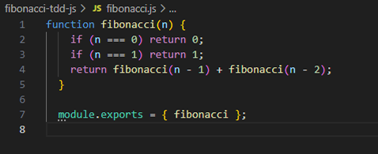
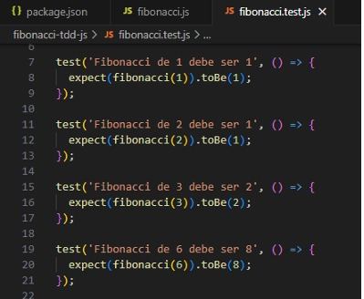
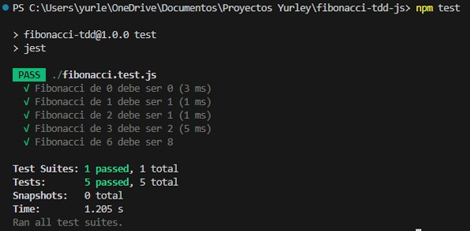

Se está usando JEST de js para llevar a cabo la prueba. 
• Como primera instancia se crea el archivo fibonacci.js, este archivo contiene la 
función principal que calcula la serie de Fibonacci. Aquí está el código: 
 

- - - 
Crea una función llamada Fibonacci(n). 
Usa lógica recursiva: 
o Si n es 0, devuelve 0. 
o Si n es 1, devuelve 1. 
o Para otros casos, suma los dos anteriores (n - 1 y n - 2). 
Usa module.exports para que esta función pueda ser usada desde 
otros archivos (como el de pruebas). 
• Luego se crea el archivo fibonacci.test.js, este es el archivo en el cual se realiza 
la prueba del correcto funcionamiento del Fibonacci, este es el código: 
 

- - - - 
Usa require('./fibonacci') para importar la función desde 
fibonacci.js. 
Usa test() y expect() de Jest para definir pruebas automáticas. 
Cada test() representa un caso. 
expect(...).toBe(...) verifica que el resultado sea exactamente lo 
esperado. 
• Como resultado del test obtenemos lo siguiente:
 

Ahí se visualiza el correcto funcionamiento de la prueba.